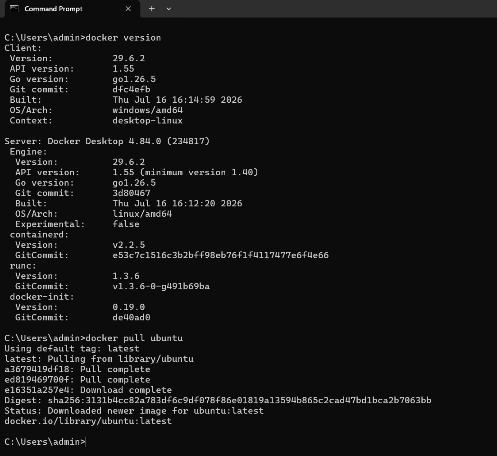
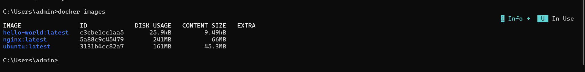
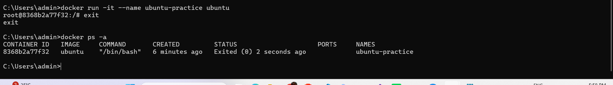
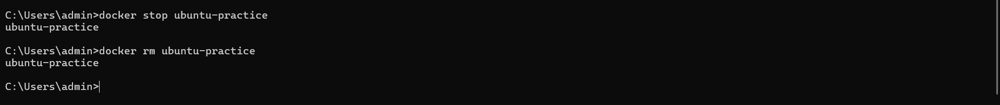
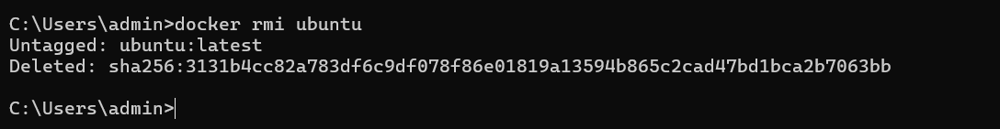
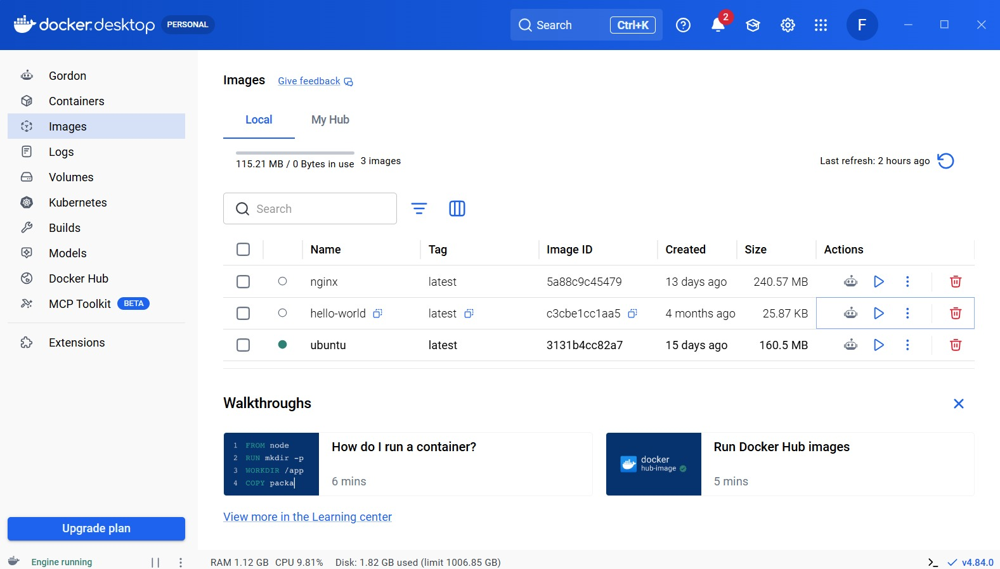

# Docker Hands-On Practice

## Objective

The objective of this hands-on practice is to learn the fundamental Docker commands, understand containerization concepts, and gain practical experience in pulling Docker images, creating containers, managing images, and verifying the Docker environment using both the command line and Docker Desktop.

---

## Prerequisites

- Docker Desktop Installed
- Docker Engine Running
- Windows Command Prompt / PowerShell
- Internet Connection

---

# Commands Used

```bash
docker version

docker pull ubuntu

docker images

docker run -it --name ubuntu-practice ubuntu

pwd

ls

cat /etc/os-release

echo "Hello Docker"

exit

docker ps -a

docker stop ubuntu-practice

docker rm ubuntu-practice

docker rmi ubuntu
```

---

# Screenshots

## 1. Docker Version and Ubuntu Image Pull

Verified the Docker installation and downloaded the latest Ubuntu image from Docker Hub.



---

## 2. Docker Images

Displayed all available Docker images present in the local Docker repository.



---

## 3. Running Ubuntu Container

Created and entered an interactive Ubuntu container. Verified the operating system information and executed basic Linux commands.

Commands executed inside the container:

```bash
pwd
ls
cat /etc/os-release
echo "Hello Docker"
```


---

## 4. Docker Containers

Verified the created Docker container using the following command:

```bash
docker ps -a
```



---

## 5. Stop and Remove Container

Stopped the running container and removed it successfully.

Commands:

```bash
docker stop ubuntu-practice
docker rm ubuntu-practice
```



---

## 6. Remove Ubuntu Image

Removed the Ubuntu Docker image from the local system.

Command:

```bash
docker rmi ubuntu
```



---

## 7. Docker Desktop Verification

Verified the downloaded Docker images using Docker Desktop GUI.

This confirms that the Ubuntu image was successfully downloaded and available inside the Docker Engine.



---

# Learning Outcomes

After completing this hands-on practice, I learned:

- Docker installation verification
- Pulling Docker images from Docker Hub
- Creating and running Docker containers
- Executing Linux commands inside a container
- Viewing Docker images and containers
- Stopping and removing containers
- Removing Docker images
- Managing Docker resources using both Command Line Interface (CLI) and Docker Desktop
- Basic workflow of containerization

---

# Conclusion

This hands-on practice provided practical experience with Docker fundamentals. I successfully downloaded an Ubuntu image, created and managed a Docker container, executed Linux commands inside the container, verified Docker resources using both the command line and Docker Desktop, and documented the complete workflow with screenshots. This practice strengthened my understanding of Docker basics and prepared me for container-based application development.